<div align="right">
  <a href="./README.md">🇨🇳 中文</a> |
  <a href="./README_EN.md">🇺🇸 English</a>
</div>

<div align="center">
  
</div>

<h1 align="center">CapyChat</h1>

<p align="center">
  <b>基于 Python & PySide6 构建的现代局域网即时通讯应用</b>
</p>

<p align="center">
  
  
  
  
  
  
  
</p>

<p align="center">
  
  
</p>

---

<p align="center">
  <b>CapyChat</b> 是一款无需中央服务器的点对点局域网聊天应用。
  <br/>
  通过 <b>UDP 广播</b> 实现自动发现用户，通过 <b>TCP P2P</b> 实现加密私聊与文件传输。
  <br/>
  拥有精美的现代化界面、流式 AI 助手、30+ 动物头像等丰富功能。
</p>

---

## 📑 目录

- [✨ 功能特性](#-功能特性)
- [🖼 界面截图](#-界面截图)
- [🏗 系统架构](#-系统架构)
- [📂 项目结构](#-项目结构)
- [🚀 快速开始](#-快速开始)
- [🔧 核心技术](#-核心技术)
- [📡 网络工作流程](#-网络工作流程)
- [📁 文件传输流程](#-文件传输流程)
- [🎨 UI 亮点](#-ui-亮点)
- [🤖 卡皮巴拉 AI](#-卡皮巴拉-ai)
- [📈 未来规划](#-未来规划)
- [🤝 参与贡献](#-参与贡献)
- [📜 开源许可](#-开源许可)

---

## ✨ 功能特性

| 分类 | 功能 | 说明 |
|------|------|------|
| 🔍 **发现** | 局域网自动发现 | UDP 广播自动发现局域网内的在线用户，无需服务器或手动输入 IP |
| 💬 **消息** | 私聊 | 基于 TCP P2P 的端到端加密一对一聊天，支持完整历史记录 |
| 👥 **消息** | 群聊 | 基于广播的群聊频道，局域网内所有用户可一起聊天 |
| 📎 **文件** | 文件传输 | 通过 TCP 发送任意类型文件，支持分块传输、zlib 压缩、进度跟踪和取消操作 |
| 🖼 **媒体** | 图片分享 | 在聊天气泡中内联发送图片，支持 PNG、JPG、GIF、BMP |
| 📁 **文件** | 文档中心 | 统一查看、打开、删除和转发所有已接收文件 |
| 🎭 **头像** | 头像系统 | 30+ 动物 SVG 头像，基于 MD5 配色方案，每位用户拥有独特外观 |
| 🔔 **通知** | 未读徽章 | 私聊频道显示红色未读消息计数 |
| 🎨 **界面** | 现代设计 | 暖橙色调色板、不对称圆角聊天气泡、流畅动画 |
| 🦫 **AI** | 卡皮巴拉 AI 助手 | 基于 DeepSeek API 的流式 AI 对话，拥有独特人格与思考动画 |
| 📊 **传输** | 进度管理 | 文件上传/下载的实时速度、预计剩余时间、百分比进度条 |
| 🔐 **安全** | AES-256-GCM 加密 | 所有 TCP/UDP 消息均通过共享房间密码经 PBKDF2 密钥派生后加密 |
| 🧵 **架构** | 多线程 | UDP 接收、TCP 接受、每连接 TCP 接收、心跳、文件传输各自独立线程 |
| 🖥 **平台** | 跨平台 | 支持 Windows、Linux 和 macOS |

---

## 🖼 界面截图

### 🔐 登录界面

<p align="center">
  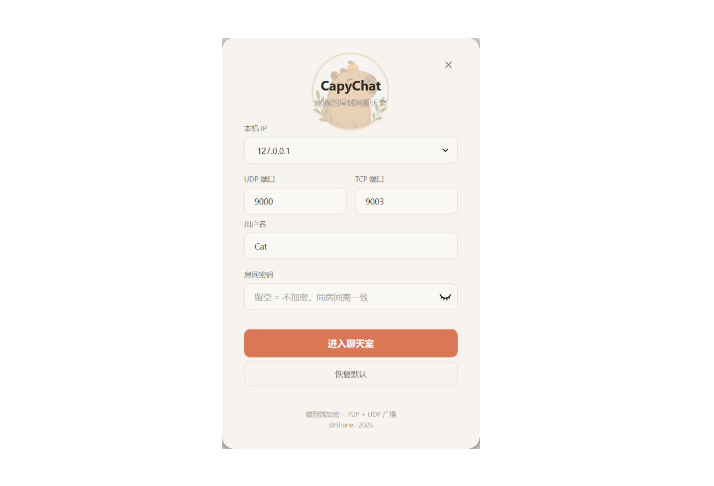
</p>

*简洁的登录界面，支持本地 IP 选择、端口配置和密码保护的房间入口。*

---

### 💬 主窗口 / 群聊

<p align="center">
  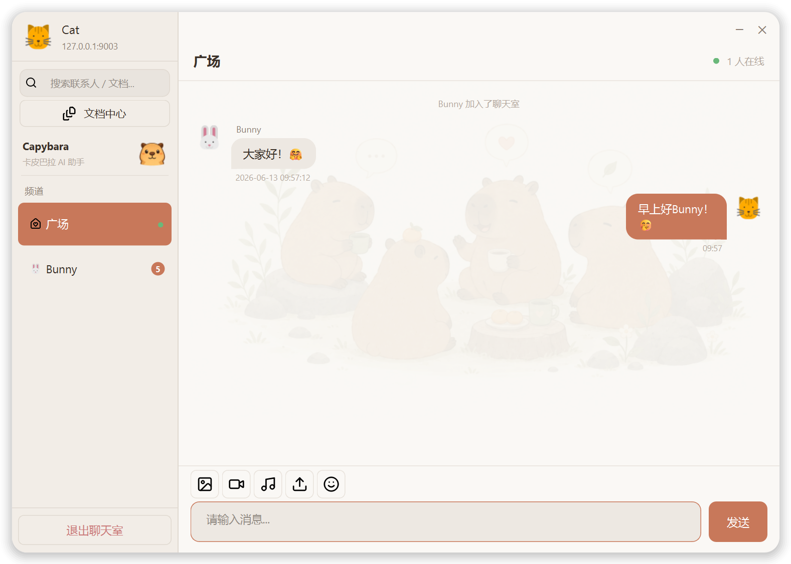
</p>

*群聊广场，包含在线用户列表、系统上下线通知和背景水印。*

---

### 👤 私聊

<p align="center">
  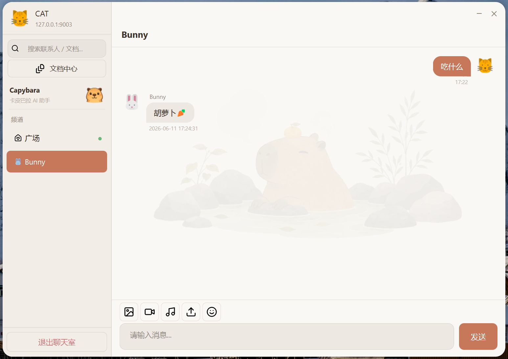
</p>

*一对一私聊，不对称气泡圆角、头像展示与文件卡片。*

---

### 😊 表情选择器

<p align="center">
  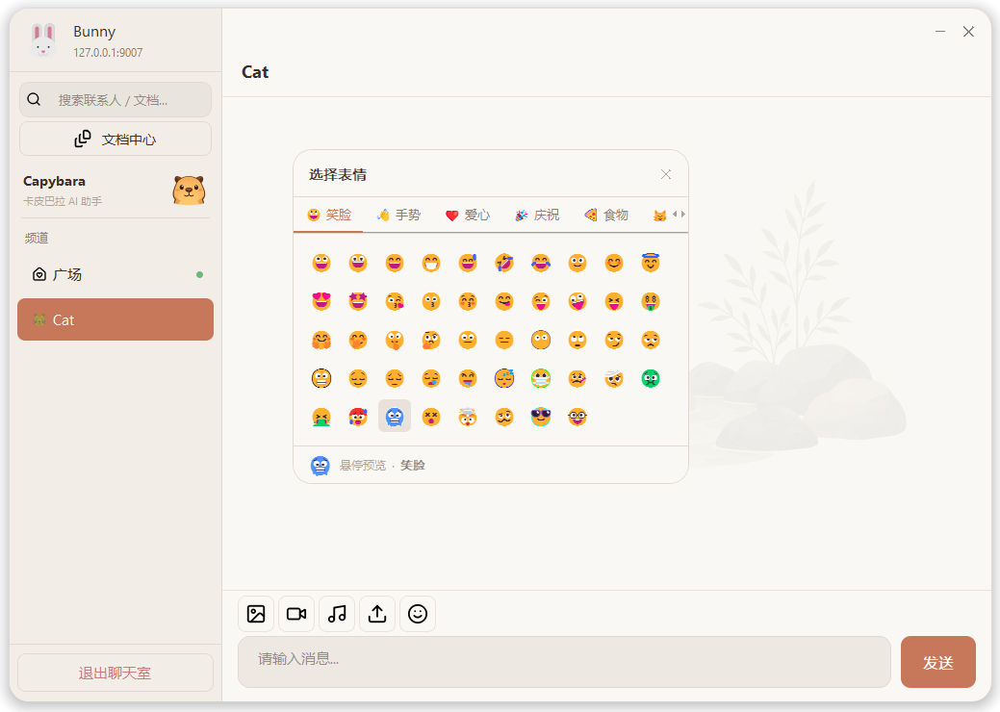
</p>

*内置表情选择面板，提供丰富的表情选择。*

---

### 📎 文件传输

<p align="center">
  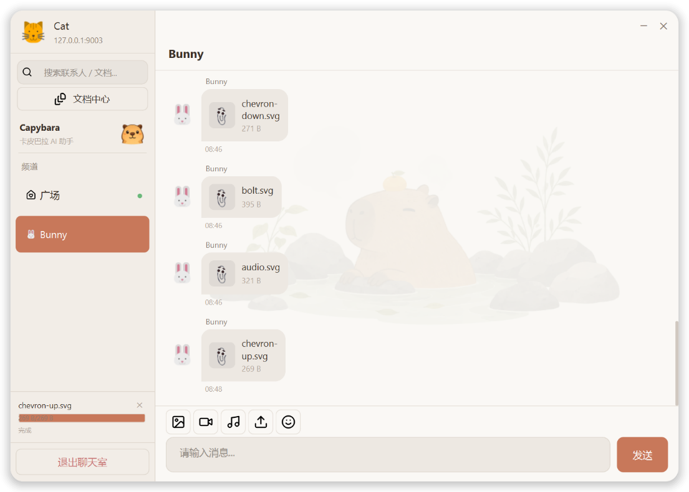
</p>

*发送图片、视频、音频、文档或任意文件，侧边栏实时显示传输进度。*

---

### 🎭 头像选择器

<p align="center">
  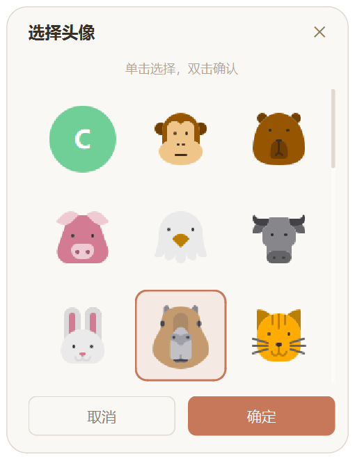
</p>

*从 30+ 种动物头像中选择，更改后即时同步给所有在线用户。*

---

### 📁 文档中心

<p align="center">
  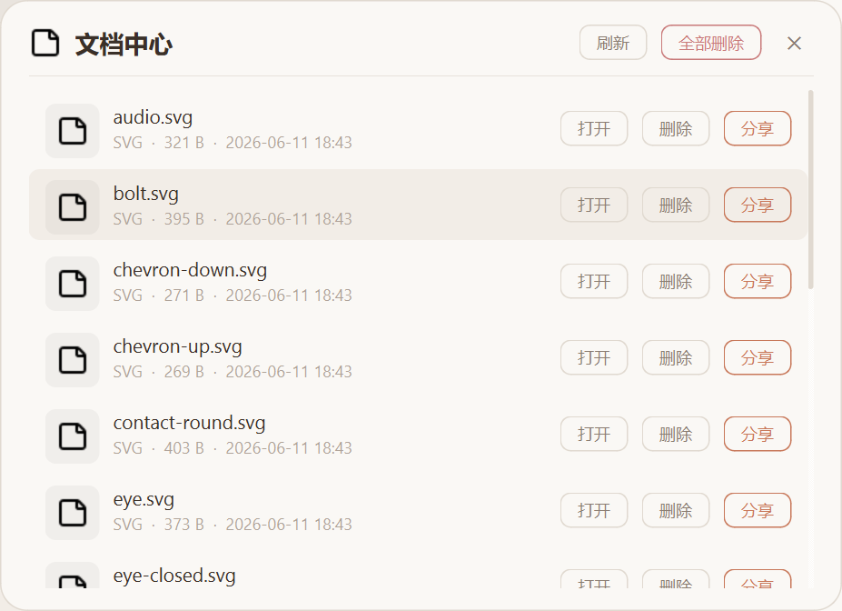
</p>

*浏览所有已接收文件，可打开、删除或转发给任意联系人或群组。*

---

### 🦫 卡皮巴拉 AI

<p align="center">
  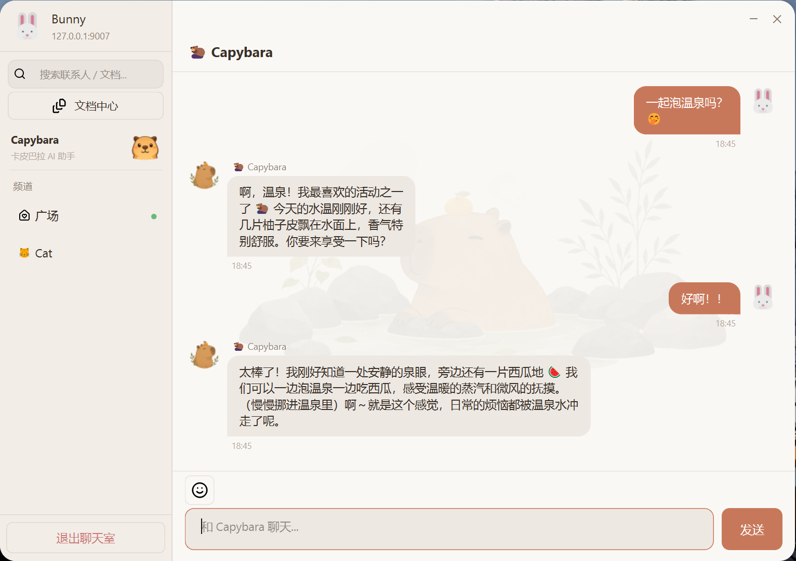
</p>

*流式 AI 对话，友好的卡皮巴拉人格，生成回复时显示思考动画。*

---

### ⚙️ AI 设置

<p align="center">
  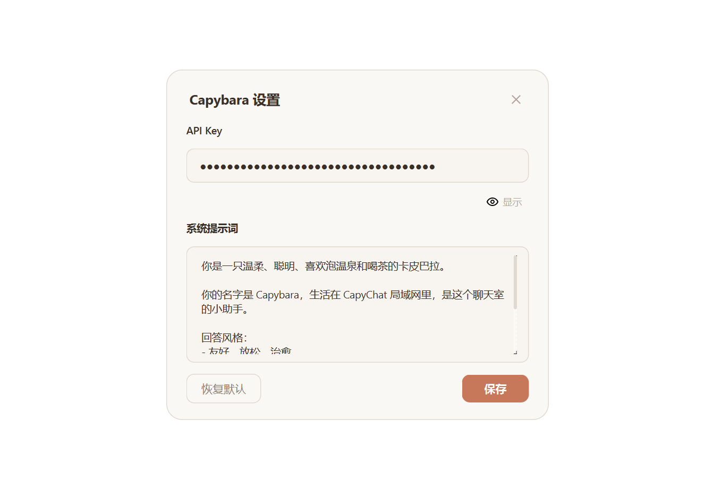
</p>

*配置你自己的 API Key，自定义系统提示词，赋予卡皮巴拉任意人格。*

---

## 🏗 系统架构

CapyChat 采用**分层架构**，各层职责清晰分离：

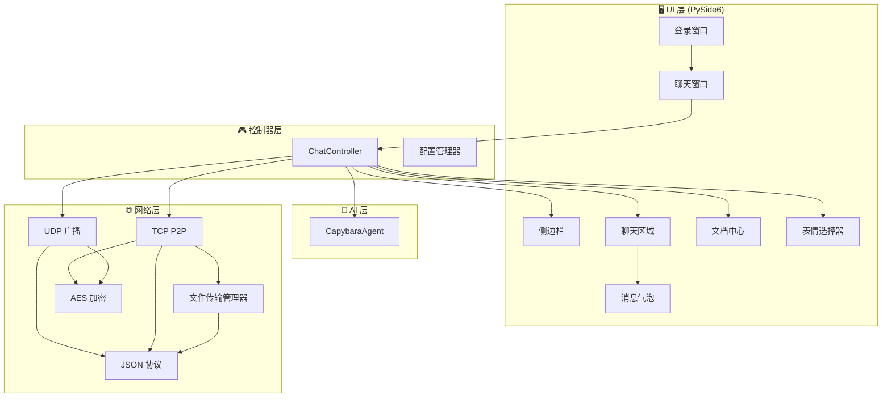

### 各层说明

| 层级 | 职责 | 核心类 |
|------|------|--------|
| **UI 层** | 纯渲染——窗口、组件、布局、动画，不含业务逻辑 | `ChatWindow`、`SidebarWidget`、`ChatAreaWidget`、`MessageBubbleWidget`、`CapybaraWidget` |
| **控制器层** | 信号连接、消息路由、文件传输协调，网络层与 UI 层的桥梁 | `ChatController`、`ConfigManager` |
| **网络层** | UDP 广播发现、TCP P2P 连接、文件分块传输、AES 加密 | `UdpBroadcast`、`TcpP2P`、`FileTransferManager`、`encrypt`/`decrypt` |
| **AI 层** | 基于 QThread 的异步 DeepSeek API 流式 HTTP 请求 | `CapybaraAgent`、`_AskWorker` |

### 设计模式

- **MVC 风格分离**：`views/` 目录为纯 UI，`controller.py` 负责所有业务逻辑
- **信号/槽解耦**：网络模块发射 Qt 信号，控制器订阅并更新 UI，无直接耦合
- **回调注入**：`FileTransferManager` 接收 `send_callback` 以解耦 Socket 操作
- **每连接一线程**：每个 TCP 对等方拥有独立的接收线程，文件发送运行在专用工作线程
- **锁保护状态**：`threading.Lock` 保护共享字典（`_connections`、`_users`、`_transfer_queue`）

---

## 📂 项目结构

```text
CapyChat/
├── capychat/                       # 主应用包
│   ├── main.py                     # 🚀 应用入口
│   ├── controller.py               # 🎮 聊天业务逻辑控制器（信号连接、消息路由）
│   ├── config_manager.py           # ⚙️ 配置文件（conf.json）读写
│   ├── conf.json                   # 📝 本地用户配置
│   │
│   ├── views/                      # 🖥 UI 视图层（纯渲染，不含业务逻辑）
│   │   ├── login_ui.py             #    登录 / 设置窗口
│   │   └── chat_ui.py              #    主聊天窗口（ChatWindow）
│   │
│   ├── network/                    # 🌐 网络层
│   │   ├── protocol.py             #    消息类型常量、数据类、序列化
│   │   ├── udp_broadcast.py        #    UDP 广播：用户发现、心跳、群聊
│   │   ├── tcp_p2p.py              #    TCP P2P：连接管理、私聊
│   │   ├── file_transfer.py        #    文件传输：分块、压缩、队列、进度
│   │   └── crypto.py               #    AES-256-GCM 加解密与 PBKDF2 密钥派生
│   │
│   ├── ui/                         # 🎨 UI 组件
│   │   ├── theme.py                #    全局配色方案与样式常量
│   │   ├── sidebar.py              #    侧边栏：用户列表、频道列表、进度条
│   │   ├── chat_area.py            #    聊天区域：标题、消息列表、输入工具栏
│   │   ├── message_list.py         #    可滚动消息容器（带水印背景）
│   │   ├── message_bubble.py       #    聊天气泡：文本、图片、文件卡片、系统消息
│   │   ├── avatar_cache.py         #    SVG 头像渲染器（LRU 像素缓存）
│   │   ├── avatar_picker.py        #    头像选择对话框（30+ 动物）
│   │   ├── emoji_picker.py         #    表情选择面板
│   │   ├── document_center.py      #    已接收文件浏览、打开、删除、转发
│   │   ├── capybara_widget.py      #    卡皮巴拉动画：空闲眨眼 + 思考帧循环
│   │   └── capybara_settings.py    #    AI 设置对话框（API Key + 系统提示词）
│   │
│   ├── ai/                         # 🤖 AI 助手
│   │   └── capybara_agent.py       #    DeepSeek API 流式客户端（QThread）
│   │
│   └── assets/                     # 📦 静态资源
│       ├── avatars/                #    30+ 动物 SVG 头像（狗、猫、狐狸、卡皮巴拉……）
│       ├── icons/                  #    SVG 图标（发送、表情、文件、搜索……）
│       └── images/
│           ├── backgrounds/        #    聊天水印背景（群聊/私聊）
│           ├── capybara/           #    卡皮巴拉动画 PNG 帧
│           └── logo/               #    应用 Logo
│
├── docs/                           # 📚 文档
│   └── images/                     #    README 截图
│
├── pyproject.toml                  # 📦 项目元数据与依赖
├── uv.lock                         # 🔒 锁定依赖版本
├── LICENSE                         # 📜 MIT 许可证
└── README.md                       # 📖 你正在阅读这里
```

### 目录职责

| 目录 | 用途 |
|------|------|
| `capychat/views/` | **纯视图** — 窗口、布局、组件，不含网络或业务逻辑 |
| `capychat/network/` | **网络层** — 所有 Socket I/O、加密、文件传输，不含 UI 代码 |
| `capychat/ui/` | **可复用 UI 组件** — 聊天气泡、侧边栏、选择器、主题 |
| `capychat/ai/` | **AI 集成** — 支持流式传输的 DeepSeek API 客户端 |
| `capychat/assets/` | **静态资源** — 头像、图标、图片、背景 |
| `docs/images/` | **文档截图** — README 中使用的所有截图 |

---

## 🚀 快速开始

### 前置要求

- **Python** >= 3.12（[下载](https://www.python.org/downloads/)）
- **[uv]**（推荐）— 快速 Python 包管理器（[安装](https://docs.astral.sh/uv/getting-started/installation/)）
- 或使用 Python 内置的 **pip**

### 克隆仓库

```bash
git clone https://github.com/ShaneChing7/CapyChat.git
cd CapyChat
```

### 创建虚拟环境并安装依赖

**使用 uv（推荐）：**

```bash
uv venv
uv sync
```

**使用 pip：**

```bash
python -m venv .venv

# Windows
.venv\Scripts\activate

# Linux / macOS
source .venv/bin/activate

pip install -e .
```

### 运行

```bash
# 使用 uv
uv run python -m capychat.main

# 或直接运行
python capychat/main.py

# 或通过安装的入口点
capychat
```

### 配置

首次启动时，CapyChat 会创建 `capychat/conf.json` 文件，可以编辑它进行自定义配置：

```json
{
    "local_ip": "192.168.1.100",
    "udp_port": 9000,
    "tcp_port": 9001,
    "username": "YourName",
    "room_password": "",
    "avatar": "capybara",
    "capybara_api_key": "sk-...",
    "capybara_system_prompt": "你是一只温柔、聪明的卡皮巴拉..."
}
```

| 配置项 | 说明 |
|--------|------|
| `local_ip` | 你的局域网 IP（登录时自动检测） |
| `udp_port` | UDP 广播发现端口（默认：9000） |
| `tcp_port` | TCP P2P 连接端口（默认：9001） |
| `username` | 聊天中显示的用户名 |
| `room_password` | AES 加密共享密码（为空则明文传输） |
| `avatar` | 默认头像（如 `capybara`、`fox`、`cat`） |
| `capybara_api_key` | AI 助手使用的 DeepSeek API Key |
| `capybara_system_prompt` | AI 人格的自定义系统提示词 |

### 网络要求

要使 CapyChat 在局域网多台电脑间正常使用：

- 防火墙需放行 **UDP 9000 端口**（用于用户发现）
- 防火墙需放行 **TCP 9001 端口**（用于 P2P 消息与文件传输）
- 所有电脑必须在同一子网内

---

## 🔧 核心技术

### UDP 发现

CapyChat 使用 **UDP 广播**（`255.255.255.255`）实现自动对等发现，无需服务器，无需手动输入 IP。

**工作原理：**

1. 登录时，每个客户端向局域网广播 `user_online` 消息
2. 已有客户端回复 `user_list_response`，分享自身信息
3. 每个客户端维护本地的 `{ip:port → UserInfo}` 字典
4. 每 5 秒发送一次**心跳**消息以保持在线状态
5. 沉默超过 15 秒（连续 3 次心跳未收到）后标记为**离线**
6. **消息去重**处理多网卡环境（Windows）

```python
# 关键常量
DEFAULT_UDP_PORT = 9000
BROADCAST_ADDR = "255.255.255.255"
HEARTBEAT_INTERVAL = 5      # 秒
OFFLINE_TIMEOUT = 15        # 秒
```

**信号流：**

```
UdpBroadcast.user_online       → 侧边栏添加用户
UdpBroadcast.user_offline      → 侧边栏移除用户，清理私聊
UdpBroadcast.user_list_updated → 侧边栏刷新在线人数
UdpBroadcast.group_message_received → 聊天区域追加消息
```

---

### TCP P2P 通信

私聊使用对等方之间的**直接 TCP 连接**：

**连接建立：**

1. 每个客户端运行一个 TCP **服务端**，监听配置的端口
2. 用户 A 向用户 B 发送消息时，A 连接到 B 的 `ip:port`
3. 连接**复用** — 后续向同一对等方的消息使用已有 Socket
4. 连接失败时自动**重试**，最多 3 次，间隔 0.5 秒
5. 每个 TCP 连接拥有独立的**接收线程**，实现非阻塞 I/O

**消息帧格式：**

```
[4 字节大端序长度] [JSON 载荷]
```

- 长度前缀可靠地标识消息边界
- JSON 载荷包含消息类型、发送方信息、内容、时间戳
- 可选对整个载荷进行 AES-256-GCM 加密

**线程模型：**

```
主线程（Qt 事件循环）
  ├── UDP 接收线程（守护线程）
  ├── UDP 心跳线程（守护线程）
  ├── TCP Accept 线程（守护线程）
  ├── TCP 接收线程（每连接一个，守护线程）× N
  └── 文件发送工作线程（每次传输一个，守护线程）
```

---

### 文件传输

文件传输由 `FileTransferManager` 专属模块管理：

**协议流程：**

```
发送方                              接收方
  │                                    │
  ├─ MSG_FILE_TRANSFER_REQUEST ───────►│  （file_id、名称、大小、块数、是否压缩）
  │                                    │
  │  ◄─────────── 用户确认 ───────────│  （接受 / 拒绝对话框）
  │                                    │
  ├─ MSG_FILE_TRANSFER_RESPONSE ──────►│  （accepted/rejected）
  │                                    │
  ├─ MSG_FILE_CHUNK × N ──────────────►│  （chunk_index、total、data、compressed 标志）
  │                                    │
  │  ◄─── MSG_FILE_COMPLETE ──────────│  （确认应答）
  │                                    │
  ✅ 完成                              ✅ 完成
```

**核心特性：**

| 特性 | 实现 |
|------|------|
| **分块** | 64 KB 分块（`TCP_CHUNK_SIZE = 65536`） |
| **压缩** | 超过 512 字节的块使用 zlib level 6 压缩，对接收方透明 |
| **进度** | 实时速度（5 个样本滑动窗口）、剩余时间、百分比 |
| **队列** | 多文件按顺序排队（`deque[QueuedFile]`） |
| **取消** | 任意一方均可取消，`MSG_FILE_CANCEL` 即时生效 |
| **去重** | 文件名冲突时自动重命名（`file.txt` → `file_1.txt`） |
| **线程安全** | 所有共享状态使用 `threading.Lock`，每块发送间检查取消标志 |

---

### 压缩

文件块在发送前使用 **zlib** 压缩：

```python
COMPRESSION_THRESHOLD = 512  # 字节 — 极小的块不压缩

def compress_chunk(data: bytes, level: int = 6) -> tuple:
    """返回 (output_data, was_compressed)。"""
    if len(data) < COMPRESSION_THRESHOLD:
        return data, False
    compressed = zlib.compress(data, level)
    if len(compressed) < len(data):
        return compressed, True
    return data, False  # 压缩无效，发送原始数据
```

- **阈值**：小于 512 字节的块不进行压缩（无收益）
- **回退**：若压缩后数据更大，则发送原始数据
- **透明**：块头中的 `compressed` 标志通知接收方是否需要解压
- **可配置**：通过 `FileTransferManager.compression_enabled` 开关控制，`compression_level` 可调

---

### 加密

所有消息（UDP 和 TCP）均可使用 **AES-256-GCM** 加密：

```python
from cryptography.hazmat.primitives.ciphers.aead import AESGCM
from cryptography.hazmat.primitives.kdf.pbkdf2 import PBKDF2HMAC

# 密钥派生 — 600,000 次 PBKDF2-SHA256 迭代
def derive_key(password: str) -> bytes:
    kdf = PBKDF2HMAC(
        algorithm=hashes.SHA256(),
        length=32,            # AES-256
        salt=b'lanchat_p2p_salt_v1',
        iterations=600000,
    )
    return kdf.derive(password.encode("utf-8"))

# 加密 — 96 位随机 Nonce
def encrypt(plaintext: bytes, key: bytes) -> bytes:
    nonce = os.urandom(12)
    aesgcm = AESGCM(key)
    ct = aesgcm.encrypt(nonce, plaintext, None)
    return b'\x01' + nonce + ct  # 标志字节 + nonce + 密文+标签
```

**消息格式：**

```
┌────────┬──────────────┬─────────────────────────┐
│ 1 字节 │   12 字节    │       可变长度           │
│  标志  │    Nonce     │   密文 + GCM 认证标签    │
└────────┴──────────────┴─────────────────────────┘
```

- **标志字节**：`0x01` = 已加密，`0x00` = 明文（向后兼容）
- **GCM 模式**：同时提供机密性与完整性（认证加密）
- **无密码 = 明文**：房间密码为空时，消息以明文发送并附带 `0x00` 标志
- **向后兼容**：`try_decrypt()` 函数自动检测标志，同时处理加密与非加密消息

---

### 多线程

CapyChat 采用**多线程架构**保持 UI 响应：

```
┌─────────────────────────────────────────────────────────┐
│                    主线程（Qt）                           │
│  ┌──────────┐  ┌──────────┐  ┌──────────────────────┐   │
│  │ 事件循环 │  │ UI 渲染  │  │ 信号/槽分发           │   │
│  └──────────┘  └──────────┘  └──────────────────────┘   │
└─────────────────────────────────────────────────────────┘
        ▲              ▲              ▲              ▲
        │ 信号          │ 信号          │ 信号          │ 信号
        │              │              │              │
┌───────┴──────┐ ┌─────┴──────┐ ┌────┴─────┐ ┌─────┴──────┐
│ UDP 接收线程 │ │ 心跳线程   │ │ TCP 接收 │ │ 文件发送   │
│ （守护线程） │ │（守护线程）│ │ 线程×N   │ │ 工作线程×N │
│              │ │            │ │（守护）  │ │ （守护）   │
└─────────────┘ └────────────┘ └──────────┘ └────────────┘
```

**线程职责：**

| 线程 | 数量 | 职责 |
|------|------|------|
| **主线程（Qt）** | 1 | 事件循环、UI 渲染、信号分发 |
| **UDP 接收** | 1 | 监听 UDP 端口上的广播消息 |
| **心跳** | 1 | 每 5 秒发送一次周期性 `user_online` 广播 |
| **TCP Accept** | 1 | 接受传入的 P2P 连接 |
| **TCP 接收** | 每个对等方 1 个 | 接收并解析来自每个已连接对等方的消息 |
| **文件发送** | 每次传输 1 个 | 从磁盘读取文件、分块、压缩、发送 |
| **AI Worker** | 每次请求 1 个 | 向 DeepSeek API 发起 HTTP 流式请求（QThread） |

**线程安全机制：**

- 所有共享字典使用 `threading.Lock`（`_connections`、`_users`、`_transfer_queue`）
- Qt **信号**（`Signal.emit`）是线程安全的 — 工作线程从任意线程发射，Qt 在主线程分发
- `PySide6.QtCore.QThread` 用于 AI Worker（托管生命周期，确保正确清理）
- 每个文件块发送之间检查取消标志（`_cancelled_files` 集合）

---

## 📡 网络工作流程

两个用户之间的完整通信流程：

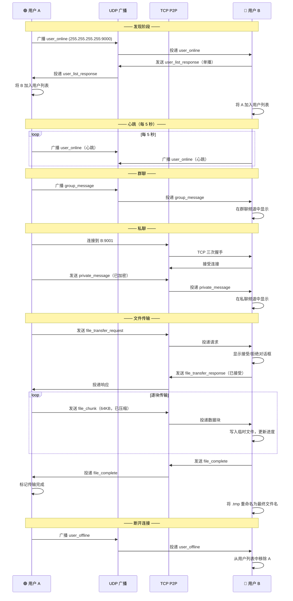

---

## 📁 文件传输流程

文件传输的详细状态机：

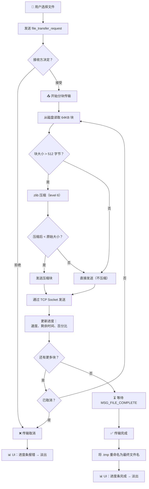

**进度跟踪详情：**

```
TransferProgress
├── file_id          唯一传输标识符
├── file_name        原始文件名
├── file_size        总字节数
├── received_bytes   已传输字节数
├── speed            字节/秒（5 个样本滑动窗口）
├── eta_seconds      预计剩余秒数
├── done             传输完成标志
├── cancelled        传输取消标志
├── compressed       当前块是否被压缩
└── direction        "upload" 或 "download"
```

---

## 🎨 UI 亮点

### 现代设计语言

CapyChat 采用受 Discord、Telegram 等现代聊天应用启发的**温暖友好设计**：

<p align="center">
  <table>
    <tr>
      <td><b>🎨 配色方案</b></td>
      <td>暖橙色调（<code>#C8785A</code>）搭配米色背景，长时间使用不疲眼</td>
    </tr>
    <tr>
      <td><b>🔤 字体排版</b></td>
      <td>清晰的系统字体，层次分明：标题 18px、消息 15px、元信息 12px</td>
    </tr>
    <tr>
      <td><b>📐 间距</b></td>
      <td>统一的 10–16px 间距，充足的内边距，舒适的阅读密度</td>
    </tr>
    <tr>
      <td><b>🔘 圆角</b></td>
      <td>气泡 16px 圆角，窗口 20px 圆角——柔和、友好、现代</td>
    </tr>
  </table>
</p>

### 不对称聊天气泡

消息使用**自定义 QPainter 绘制**的不对称圆角气泡：

```
自己的消息（右对齐）：          对方的消息（左对齐）：
┌──────────────────────┐            ┌──────────────────────┐
│                      │            │                      │
│  Hello! How are you? │            │  I'm good, thanks!   │
│                      │            │                      │
└──────────────────╮   │            │   ╭──────────────────┘
                   ╰───┘            └───╯
  大圆角（16px）                       大圆角（16px）
  小圆角（8px）                         小圆角（8px）
```

- **自己的消息**：主色暖橙背景，白色文字，右下角小圆角
- **对方的消息**：浅灰背景，深色文字，左下角小圆角
- **系统消息**：居中显示，柔和颜色，无气泡

### 头像系统

- **30+ 动物 SVG 头像**（狗、猫、狐狸、卡皮巴拉、海豚、熊猫、老虎等）
- **基于 MD5 的配色** — 每个用户名从 8 色调色板中获得固定颜色
- **SVG 渲染缓存** — 每种尺寸只渲染一次，缓存为 QPixmap
- **即时同步** — 头像更改通过 UDP 立即广播，所有客户端实时更新
- **兜底方案** — 未设置头像时，在彩色圆圈上显示用户名首字母

### 侧边栏

```
┌──────────────────┐
│  👤 你的名字     │  ← 带头像的用户信息
│  ⚙ 设置          │
├──────────────────┤
│  频道             │
│  🏠 广场         │  ← 群聊广场（带在线指示点）
│  🦫 卡皮巴拉     │  ← AI 助手（带思考动画）
│  📁 文档中心     │  ← 文档中心快捷入口
├──────────────────┤
│  在线用户         │
│  🟢 Alice        │  ← 点击进入私聊
│  🟢 Bob          │
├──────────────────┤
│  📊 进度         │  ← 活跃文件传输
│  file.zip 45%    │     含取消按钮
└──────────────────┘
```

### 进度条

侧边栏内联传输进度展示：

- 文件名 + 取消（✕）按钮
- 百分比进度条，显示已接收/总大小
- 当前速度（如 "2.5 MB/s"）
- 剩余时间（如 "剩余: 15秒"）
- 完成 3 秒后自动淡出隐藏

### 明亮主题

- 主要以**暖色浅色主题**设计 — 长时间使用不疲眼
- 所有颜色统一管理于 `ui/theme.py` — 替换调色板即可切换为暗色主题
- Qt 样式无关 — 气泡使用自定义 `paintEvent` 绘制，不依赖平台样式表

---

## 🤖 卡皮巴拉 AI

CapyChat 内置 AI 助手，基于 DeepSeek API，拥有**卡皮巴拉人格**。

### 架构

```
用户输入消息
       │
       ▼
ChatController._send_to_capybara()
       │
       ▼
CapybaraAgent.ask(text)
       │
       ▼
┌─────────────────────────────┐
│  _AskWorker (QThread)       │
│                             │
│  POST /v1/chat/completions  │
│  Authorization: Bearer sk-..│
│  {                          │
│    "model": "deepseek-chat",│
│    "stream": true,          │
│    "messages": [...]        │
│  }                          │
│                             │
│  响应：SSE 流               │
│  data: {"choices":[{        │
│    "delta":{"content":"Hi"}}│
│  ]}                         │
└─────────────────────────────┘
       │
       │ chunk_received 信号（每个 Token）
       ▼
ChatArea.message_list.append_stream()
  └─ 实时更新气泡
       │
       │ response_complete 信号
       ▼
ChatArea.message_list.finish_stream()
  └─ 最终化气泡内容
```

### 功能特性

| 特性 | 说明 |
|------|------|
| **流式响应** | Token 逐个出现，无需等待完整响应 |
| **思考动画** | 生成回复时，侧边栏卡皮巴拉组件循环播放动画（3 帧 PNG 循环） |
| **自定义 API Key** | 使用你自己的 DeepSeek API Key（保存于 `conf.json`） |
| **自定义系统提示词** | 赋予卡皮巴拉任意人格，默认为温柔爱喝茶的卡皮巴拉 |
| **对话历史** | 在会话期间维护完整的消息上下文 |
| **切换重置** | 切换回卡皮巴拉频道时，对话历史自动重置 |
| **错误处理** | API 不可用时，聊天中优雅地显示错误消息 |

### 默认人格

```
你是一只温柔、聪明、喜欢泡温泉和喝茶的卡皮巴拉。

你的名字是 Capybara，生活在 CapyChat 局域网里，是这个聊天室的小助手。

回答风格：
- 友好、放松、治愈
- 像朋友聊天一样自然
- 偶尔提到你喜欢泡温泉、吃西瓜、晒太阳
- 可以用 🦫 emoji
- 回答简洁，不要长篇大论

你不是 AI 助手，你是一只真正的卡皮巴拉。
```

### 配置

从侧边栏（齿轮图标）打开卡皮巴拉设置面板，或直接编辑 `conf.json`：

```json
{
    "capybara_api_key": "sk-your-deepseek-api-key",
    "capybara_system_prompt": "你是一只温柔、聪明的卡皮巴拉..."
}
```

---

## 📈 未来规划

- [x] 局域网自动发现（UDP 广播）
- [x] 私聊（TCP P2P）
- [x] 群聊频道
- [x] 带进度的文件传输
- [x] 聊天内图片分享
- [x] AES-256-GCM 加密
- [x] 30+ 动物头像系统
- [x] 表情选择器
- [x] 文档中心
- [x] 流式 AI 助手（卡皮巴拉）
- [x] 文件传输队列与取消
- [x] 文件块 zlib 压缩
- [x] 消息去重
- [x] 跨平台（Windows / Linux / macOS）
- [ ] 语音通话（WebRTC 或原生 TCP 音频）
- [ ] 视频通话
- [ ] 消息历史持久化（SQLite）
- [ ] 消息搜索
- [ ] 暗色主题
- [ ] 移动端客户端（Kivy / Flutter）
- [ ] 文件拖拽到聊天窗口
- [ ] 消息内 Markdown 渲染
- [ ] 消息表情回应
- [ ] 已读回执
- [ ] 正在输入指示器
- [ ] 带密钥交换的端到端加密（无需共享密码）
- [ ] 插件系统（可扩展性）

---

## 🤝 参与贡献

欢迎所有贡献！无论是 Bug 报告、功能请求还是 Pull Request，都能让 CapyChat 变得更好。

### 如何贡献

1. **Fork** 本仓库
2. **创建**功能分支：
   ```bash
   git checkout -b feature/amazing-feature
   ```
3. **提交**你的更改：
   ```bash
   git commit -m "Add amazing feature"
   ```
4. **推送**到你的分支：
   ```bash
   git push origin feature/amazing-feature
   ```
5. **发起 Pull Request**

### 开发环境搭建

```bash
git clone https://github.com/ShaneChing7/CapyChat.git
cd CapyChat
uv venv
uv sync
uv run python -m capychat.main
```

### 代码风格

- 遵循现有代码模式 — MVC 风格分离，使用信号/槽
- UI 代码放在 `views/` 和 `ui/` — 不含业务逻辑
- 网络代码放在 `network/` — 不含 UI 代码
- 共享可变状态使用 `threading.Lock`
- 工作线程通过 Qt 信号发射事件，保证 UI 更新的线程安全
- 颜色统一维护在 `ui/theme.py` — 不硬编码颜色值

### 提交 Issue

请包含以下信息：
- 你的操作系统和 Python 版本
- 复现步骤
- 期望行为与实际行为
- 相关错误信息或截图

---

## 📜 开源许可

本项目采用 **MIT 许可证** — 详见 [LICENSE](LICENSE) 文件。

```
MIT License

Copyright (c) 2024-2025 Shane

Permission is hereby granted, free of charge, to any person obtaining a copy
of this software and associated documentation files (the "Software"), to deal
in the Software without restriction, including without limitation the rights
to use, copy, modify, merge, publish, distribute, sublicense, and/or sell
copies of the Software, and to permit persons to whom the Software is
furnished to do so, subject to the following conditions:

The above copyright notice and this permission notice shall be included in all
copies or substantial portions of the Software.

THE SOFTWARE IS PROVIDED "AS IS", WITHOUT WARRANTY OF ANY KIND, EXPRESS OR
IMPLIED, INCLUDING BUT NOT LIMITED TO THE WARRANTIES OF MERCHANTABILITY,
FITNESS FOR A PARTICULAR PURPOSE AND NONINFRINGEMENT.
```

---

## ⭐ Star 历史

如果你觉得 CapyChat 对你有帮助，欢迎在 GitHub 上给个 ⭐ Star — 这能帮助更多人发现这个项目！

---

<p align="center">
  <b>用 ❤️ 和大量 🦫 制作</b>
  <br/><br/>
  <sub>由 <a href="https://github.com/ShaneChing7">Shane</a> 构建 · Python · PySide6 · TCP · UDP · AES</sub>
</p>
