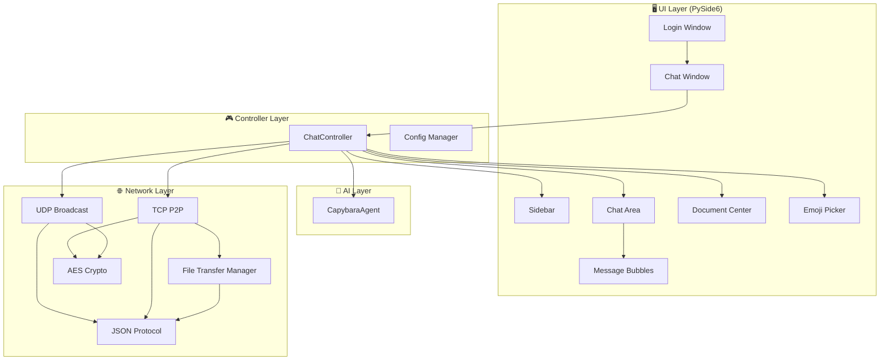
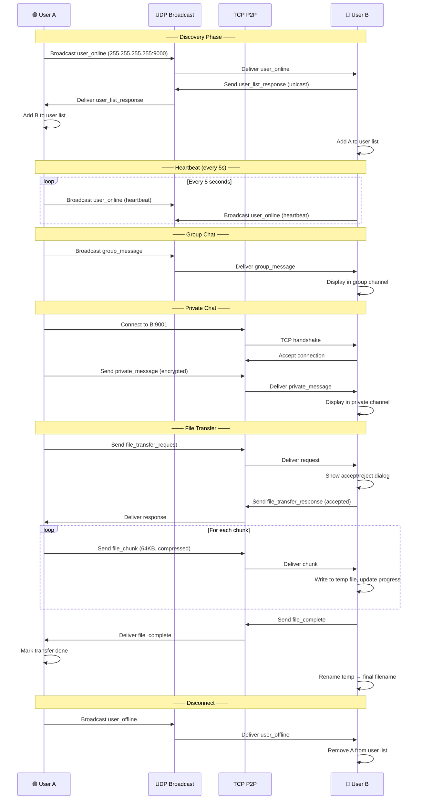
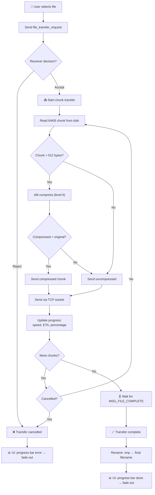

<div align="right">
  <a href="./README.md">🇨🇳 中文</a> |
  <a href="./README_EN.md">🇺🇸 English</a>
</div>

<div align="center">
  
</div>

<h1 align="center">CapyChat</h1>

<p align="center">
  <b>Modern LAN Instant Messaging Application Built With Python & PySide6</b>
</p>

<p align="center">
  
  
  
  
  
  
  
</p>

<p align="center">
  
  
</p>

---

<p align="center">
  <b>CapyChat</b> is a peer-to-peer LAN chat application that works without a central server.
  <br/>
  Powered by <b>UDP broadcast</b> for automatic user discovery and <b>TCP P2P</b> for encrypted private messaging and file transfer.
  <br/>
  Features a beautiful modern UI, streaming AI assistant, 30+ animal avatars, and much more.
</p>

---

## 📑 Table of Contents

- [✨ Features](#-features)
- [🖼 Screenshots](#-screenshots)
- [🏗 Architecture](#-architecture)
- [📂 Project Structure](#-project-structure)
- [🚀 Getting Started](#-getting-started)
- [🔧 Core Technologies](#-core-technologies)
- [📡 Network Workflow](#-network-workflow)
- [📁 File Transfer Workflow](#-file-transfer-workflow)
- [🎨 UI Highlights](#-ui-highlights)
- [🤖 Capybara AI](#-capybara-ai)
- [📈 Future Roadmap](#-future-roadmap)
- [🤝 Contributing](#-contributing)
- [📜 License](#-license)

---

## ✨ Features

| Category | Feature | Description |
|----------|---------|-------------|
| 🔍 **Discovery** | LAN Auto-Discovery | UDP broadcast automatically finds online users on the local network — no server or manual IP entry needed |
| 💬 **Messaging** | Private Chat | TCP P2P end-to-end encrypted 1-on-1 messaging with full history |
| 👥 **Messaging** | Group Chat | Broadcast-based group channel where everyone on the LAN can chat together |
| 📎 **File Transfer** | File Sharing | Send any file type via TCP with chunked transfer, zlib compression, progress tracking, and cancel support |
| 🖼 **Media** | Image Sharing | Send images inline with chat bubbles — supports PNG, JPG, GIF, BMP |
| 📁 **Files** | Document Center | Central hub to browse, open, delete, and re-share all received files |
| 🎭 **Avatar** | Avatar System | 30+ animal SVG avatars with MD5-based color palette — every user gets a unique look |
| 🔔 **Notifications** | Unread Badge | Red badge counts on private chat channels for unread messages |
| 🎨 **UI** | Modern Design | Warm orange color palette, asymmetric rounded chat bubbles, smooth animations |
| 🦫 **AI** | Capybara AI Assistant | Streaming AI chat powered by DeepSeek API with custom personality and thinking animations |
| 📊 **Transfer** | Progress Management | Real-time speed, ETA, percentage bars for file uploads/downloads |
| 🔐 **Security** | AES-256-GCM Encryption | All TCP/UDP messages encrypted with PBKDF2 key derivation from a shared room password |
| 🧵 **Architecture** | Multi-Threaded | Separate threads for UDP receive, TCP accept, TCP receive per connection, heartbeat, and file transfer |
| 🖥 **Platform** | Cross-Platform | Runs on Windows, Linux, and macOS |

---

## 🖼 Screenshots

### 🔐 Login

<p align="center">
  
</p>

*Clean login interface with local IP selection, port configuration, and password-protected room entry.*

---

### 💬 Main Window / Group Chat

<p align="center">
  
</p>

*Group plaza with online user list, system join/leave notifications, and background watermark.*

---

### 👤 Private Chat

<p align="center">
  
</p>

*1-on-1 private chat with asymmetric bubble corners, avatar display, and file cards.*

---

### 😊 Emoji Picker

<p align="center">
  
</p>

*Built-in emoji picker panel with rich emoji selection.*

---

### 📎 File Transfer

<p align="center">
  
</p>

*Send images, videos, audio, documents, or any file — with real-time progress bars in the sidebar.*

---

### 🎭 Avatar Picker

<p align="center">
  
</p>

*Choose from 30+ animal avatars — changes sync instantly across all online users.*

---

### 📁 Document Center

<p align="center">
  
</p>

*Browse all received files — open, delete, or re-share to any contact or group.*

---

### 🦫 Capybara AI

<p align="center">
  
</p>

*Streaming AI chat with the friendly capybara personality — thinking animations while generating responses.*

---

### ⚙️ AI Settings

<p align="center">
  
</p>

*Configure your own API key and customize the system prompt to give Capybara any personality.*

---

## 🏗 Architecture

CapyChat is built on a **layered architecture** with clear separation of concerns:



### Layer Descriptions

| Layer | Responsibility | Key Classes |
|-------|---------------|-------------|
| **UI Layer** | Pure rendering — windows, widgets, layouts, animations. No business logic. | `ChatWindow`, `SidebarWidget`, `ChatAreaWidget`, `MessageBubbleWidget`, `CapybaraWidget` |
| **Controller Layer** | Signal wiring, message routing, file transfer coordination. Bridges network ↔ UI. | `ChatController`, `ConfigManager` |
| **Network Layer** | UDP broadcast discovery, TCP P2P connections, file chunk transfer, AES encryption. | `UdpBroadcast`, `TcpP2P`, `FileTransferManager`, `encrypt`/`decrypt` |
| **AI Layer** | Streaming HTTP requests to DeepSeek API with QThread-based async execution. | `CapybaraAgent`, `_AskWorker` |

### Design Patterns

- **MVC-inspired separation**: Views (`views/`) are pure UI; Controller (`controller.py`) owns all business logic
- **Signal/Slot decoupling**: Network modules emit Qt signals; Controller subscribes and updates UI — no direct coupling
- **Callback injection**: `FileTransferManager` receives a `send_callback` to decouple from socket operations
- **Thread-per-connection**: Each TCP peer gets its own receive thread; file send runs on dedicated worker threads
- **Lock-guarded state**: `threading.Lock` protects shared dictionaries (`_connections`, `_users`, `_transfer_queue`)

---

## 📂 Project Structure

```text
CapyChat/
├── capychat/                       # Main application package
│   ├── main.py                     # 🚀 Application entry point
│   ├── controller.py               # 🎮 Chat business logic controller (signal wiring, message routing)
│   ├── config_manager.py           # ⚙️ Configuration file (conf.json) read/write
│   ├── conf.json                   # 📝 Local user configuration
│   │
│   ├── views/                      # 🖥 UI View layer (pure rendering, no business logic)
│   │   ├── login_ui.py             #    Login / settings window
│   │   └── chat_ui.py              #    Main chat window (ChatWindow)
│   │
│   ├── network/                    # 🌐 Network layer
│   │   ├── protocol.py             #    Message type constants, data classes, serialization
│   │   ├── udp_broadcast.py        #    UDP broadcast: user discovery, heartbeat, group chat
│   │   ├── tcp_p2p.py              #    TCP P2P: connection management, private messaging
│   │   ├── file_transfer.py        #    File transfer: chunking, compression, queues, progress
│   │   └── crypto.py               #    AES-256-GCM encryption/decryption with PBKDF2 key derivation
│   │
│   ├── ui/                         # 🎨 UI Components
│   │   ├── theme.py                #    Global color palette and style constants
│   │   ├── sidebar.py              #    Sidebar: user list, channel list, progress bars
│   │   ├── chat_area.py            #    Chat area: header, message list, input toolbar
│   │   ├── message_list.py         #    Scrollable message container with watermark background
│   │   ├── message_bubble.py       #    Chat bubbles: text, image, file card, system message
│   │   ├── avatar_cache.py         #    SVG avatar renderer with LRU pixmap cache
│   │   ├── avatar_picker.py        #    Avatar selection dialog (30+ animals)
│   │   ├── emoji_picker.py         #    Emoji picker panel
│   │   ├── document_center.py      #    Received files browser, opener, deleter, re-sharer
│   │   ├── capybara_widget.py      #    Capybara animation: idle blink + thinking frame loop
│   │   └── capybara_settings.py    #    AI settings dialog (API key + system prompt)
│   │
│   ├── ai/                         # 🤖 AI Assistant
│   │   └── capybara_agent.py       #    DeepSeek API streaming client with QThread
│   │
│   └── assets/                     # 📦 Static resources
│       ├── avatars/                #    30+ animal SVG avatars (dog, cat, fox, capybara...)
│       ├── icons/                  #    SVG icons (send, emoji, file, search...)
│       └── images/
│           ├── backgrounds/        #    Chat watermark backgrounds (group/single)
│           ├── capybara/           #    Capybara animation PNG frames
│           └── logo/               #    Application logo
│
├── docs/                           # 📚 Documentation
│   └── images/                     #    Screenshots for README
│
├── pyproject.toml                  # 📦 Project metadata and dependencies
├── uv.lock                         # 🔒 Locked dependency versions
├── LICENSE                         # 📜 MIT License
└── README.md                       # 📖 You are here
```

### Directory Roles

| Directory | Purpose |
|-----------|---------|
| `capychat/views/` | **Pure View** — windows, layouts, widgets. No network or business logic. |
| `capychat/network/` | **Networking** — all socket I/O, encryption, file transfer. No UI code. |
| `capychat/ui/` | **Reusable UI Components** — chat bubbles, sidebars, pickers, themes. |
| `capychat/ai/` | **AI Integration** — DeepSeek API client with streaming support. |
| `capychat/assets/` | **Static Assets** — avatars, icons, images, backgrounds. |
| `docs/images/` | **Documentation Screenshots** — all screenshots used in this README. |

---

## 🚀 Getting Started

### Prerequisites

- **Python** >= 3.12 ([download](https://www.python.org/downloads/))
- **[uv]** (recommended) — fast Python package manager ([install](https://docs.astral.sh/uv/getting-started/installation/))
- Or **pip** (built-in with Python)

### Clone

```bash
git clone https://github.com/ShaneChing7/CapyChat.git
cd CapyChat
```

### Create Virtual Environment & Install Dependencies

**Using uv (recommended):**

```bash
uv venv
uv sync
```

**Using pip:**

```bash
python -m venv .venv

# Windows
.venv\Scripts\activate

# Linux / macOS
source .venv/bin/activate

pip install -e .
```

### Run

```bash
# Using uv
uv run python -m capychat.main

# Or directly
python capychat/main.py

# Or via installed entry point
capychat
```

### Configuration

On first launch, CapyChat creates a `capychat/conf.json` file. You can edit it to customize:

```json
{
    "local_ip": "192.168.1.100",
    "udp_port": 9000,
    "tcp_port": 9001,
    "username": "YourName",
    "room_password": "",
    "avatar": "capybara",
    "capybara_api_key": "sk-...",
    "capybara_system_prompt": "你是一只温柔、聪明的卡皮巴拉..."
}
```

| Setting | Description |
|---------|-------------|
| `local_ip` | Your LAN IP address (auto-detected on login) |
| `udp_port` | UDP port for broadcast discovery (default: 9000) |
| `tcp_port` | TCP port for P2P connections (default: 9001) |
| `username` | Your display name in chat |
| `room_password` | Shared password for AES encryption (empty = plaintext) |
| `avatar` | Default avatar key (e.g., `capybara`, `fox`, `cat`) |
| `capybara_api_key` | DeepSeek API key for the AI assistant |
| `capybara_system_prompt` | Custom system prompt for AI personality |

### Network Requirements

For CapyChat to work across computers on your LAN:

- **UDP port 9000** must be allowed through firewall (for user discovery)
- **TCP port 9001** must be allowed through firewall (for P2P messaging and file transfer)
- All computers must be on the same subnet

---

## 🔧 Core Technologies

### UDP Discovery

CapyChat uses **UDP broadcast** (`255.255.255.255`) for automatic peer discovery — no server, no manual IP entry.

**How it works:**

1. On login, each client broadcasts a `user_online` message to the LAN
2. Existing clients respond with `user_list_response`, sharing their own info
3. Each client maintains a local `{ip:port → UserInfo}` dictionary
4. **Heartbeat** messages are sent every 5 seconds to signal continued presence
5. Users are marked **offline** after 15 seconds of silence (3 missed heartbeats)
6. Message **deduplication** handles multi-NIC environments (Windows)

```python
# Key constants
DEFAULT_UDP_PORT = 9000
BROADCAST_ADDR = "255.255.255.255"
HEARTBEAT_INTERVAL = 5      # seconds
OFFLINE_TIMEOUT = 15        # seconds
```

**Signal flow:**

```
UdpBroadcast.user_online    → Sidebar adds user
UdpBroadcast.user_offline   → Sidebar removes user, cleanup private chats
UdpBroadcast.user_list_updated → Sidebar refreshes online count
UdpBroadcast.group_message_received → Chat area appends message
```

---

### TCP P2P Communication

Private messaging uses **direct TCP connections** between peers:

**Connection establishment:**

1. Each client runs a TCP **server** listening on its configured port
2. When User A wants to message User B, A connects to B's `ip:port`
3. Connection is **reused** — subsequent messages to the same peer use the existing socket
4. Automatic **retry** up to 3 times with 0.5s intervals on connection failure
5. Each TCP connection gets its own **receive thread** for non-blocking I/O

**Message framing:**

```
[4-byte big-endian length] [JSON payload]
```

- Length prefix enables reliable message boundary detection
- JSON payload contains message type, sender info, content, timestamp
- Optional AES-256-GCM encryption of the entire payload

**Thread model:**

```
Main Thread (Qt Event Loop)
  ├── UDP Receive Thread (daemon)
  ├── UDP Heartbeat Thread (daemon)
  ├── TCP Accept Thread (daemon)
  ├── TCP Receive Thread per connection (daemon) × N
  └── File Send Worker Thread (per transfer, daemon)
```

---

### File Transfer

File transfer is managed by `FileTransferManager`, a dedicated module with:

**Protocol:**

```
Sender                              Receiver
  │                                    │
  ├─ MSG_FILE_TRANSFER_REQUEST ───────►│  (file_id, name, size, chunks, compressed)
  │                                    │
  │  ◄─────────── User confirms ──────│  (Accept / Reject dialog)
  │                                    │
  ├─ MSG_FILE_TRANSFER_RESPONSE ──────►│  (accepted/rejected)
  │                                    │
  ├─ MSG_FILE_CHUNK × N ──────────────►│  (chunk_index, total, data, compressed flag)
  │                                    │
  │  ◄─── MSG_FILE_COMPLETE ──────────│  (acknowledgment)
  │                                    │
  ✅ Done                              ✅ Done
```

**Key features:**

| Feature | Implementation |
|---------|---------------|
| **Chunking** | 64 KB chunks (`TCP_CHUNK_SIZE = 65536`) |
| **Compression** | zlib level 6 for chunks > 512 bytes — transparent to the receiver |
| **Progress** | Real-time speed (moving window of 5 samples), ETA, percentage |
| **Queue** | Multiple files queue sequentially (`deque[QueuedFile]`) |
| **Cancel** | Either side can cancel — `MSG_FILE_CANCEL` propagates instantly |
| **Dedup** | Auto-renames files on collision (`file.txt` → `file_1.txt`) |
| **Thread safety** | `threading.Lock` on all shared state; cancel-check between every chunk |

---

### Compression

File chunks are compressed with **zlib** before sending:

```python
COMPRESSION_THRESHOLD = 512  # bytes — don't compress tiny chunks

def compress_chunk(data: bytes, level: int = 6) -> tuple:
    """Returns (output_data, was_compressed)."""
    if len(data) < COMPRESSION_THRESHOLD:
        return data, False
    compressed = zlib.compress(data, level)
    if len(compressed) < len(data):
        return compressed, True
    return data, False  # compression didn't help — send original
```

- **Threshold**: chunks under 512 bytes are never compressed (no benefit)
- **Fallback**: if compressed data is larger than original, send uncompressed
- **Transparent**: the `compressed` flag in the chunk header tells the receiver whether to decompress
- **Configurable**: toggle via `FileTransferManager.compression_enabled` and adjust `compression_level`

---

### Encryption

All messages (UDP and TCP) can be encrypted with **AES-256-GCM**:

```python
from cryptography.hazmat.primitives.ciphers.aead import AESGCM
from cryptography.hazmat.primitives.kdf.pbkdf2 import PBKDF2HMAC

# Key derivation — 600,000 PBKDF2-SHA256 iterations
def derive_key(password: str) -> bytes:
    kdf = PBKDF2HMAC(
        algorithm=hashes.SHA256(),
        length=32,            # AES-256
        salt=b'lanchat_p2p_salt_v1',
        iterations=600000,
    )
    return kdf.derive(password.encode("utf-8"))

# Encryption — 96-bit random nonce
def encrypt(plaintext: bytes, key: bytes) -> bytes:
    nonce = os.urandom(12)
    aesgcm = AESGCM(key)
    ct = aesgcm.encrypt(nonce, plaintext, None)
    return b'\x01' + nonce + ct  # flag byte + nonce + ciphertext+tag
```

**Message format:**

```
┌────────┬──────────────┬─────────────────────────┐
│ 1 byte │   12 bytes   │     variable length      │
│  Flag  │    Nonce     │   Ciphertext + GCM Tag   │
└────────┴──────────────┴─────────────────────────┘
```

- **Flag byte**: `0x01` = encrypted, `0x00` = plaintext (backward compatible)
- **GCM mode**: provides both confidentiality and integrity (authenticated encryption)
- **No password = plaintext**: if the room password is empty, messages are sent in plaintext with the `0x00` flag
- **Backward compatible**: the `try_decrypt()` function auto-detects the flag and handles both encrypted and unencrypted messages

---

### Multithreading

CapyChat uses a **multi-threaded architecture** to keep the UI responsive:

```
┌─────────────────────────────────────────────────────────┐
│                    Main Thread (Qt)                       │
│  ┌──────────┐  ┌──────────┐  ┌──────────────────────┐   │
│  │ Event    │  │ UI       │  │ Signal/Slot          │   │
│  │ Loop     │  │ Rendering│  │ Dispatch             │   │
│  └──────────┘  └──────────┘  └──────────────────────┘   │
└─────────────────────────────────────────────────────────┘
        ▲              ▲              ▲              ▲
        │ Signals      │ Signals      │ Signals      │ Signals
        │              │              │              │
┌───────┴──────┐ ┌─────┴──────┐ ┌────┴─────┐ ┌─────┴──────┐
│ UDP Recv    │ │ Heartbeat  │ │ TCP Recv │ │ File Send  │
│ Thread      │ │ Thread     │ │ Thread×N │ │ Worker×N   │
│ (daemon)    │ │ (daemon)   │ │ (daemon) │ │ (daemon)   │
└─────────────┘ └────────────┘ └──────────┘ └────────────┘
```

**Thread responsibilities:**

| Thread | Count | Purpose |
|--------|-------|---------|
| **Main (Qt)** | 1 | Event loop, UI rendering, signal dispatch |
| **UDP Recv** | 1 | Listen for broadcast messages on UDP port |
| **Heartbeat** | 1 | Send periodic `user_online` broadcasts every 5s |
| **TCP Accept** | 1 | Accept incoming P2P connections |
| **TCP Recv** | 1 per peer | Receive and parse messages from each connected peer |
| **File Send** | 1 per transfer | Read file from disk, chunk, compress, send |
| **AI Worker** | 1 per request | HTTP streaming request to DeepSeek API (QThread) |

**Thread safety mechanisms:**

- `threading.Lock` on all shared dictionaries (`_connections`, `_users`, `_transfer_queue`)
- Qt **Signals** (`Signal.emit`) are thread-safe — workers emit from any thread, Qt delivers on main thread
- `PySide6.QtCore.QThread` for AI worker (managed lifecycle, proper cleanup)
- Cancel-check flags (`_cancelled_files` set) between every file chunk

---

## 📡 Network Workflow

Complete communication flow between two users:



---

## 📁 File Transfer Workflow

Detailed file transfer state machine:



**Progress tracking details:**

```
TransferProgress
├── file_id          Unique transfer identifier
├── file_name        Original filename
├── file_size        Total bytes
├── received_bytes   Bytes transferred so far
├── speed            Bytes/sec (5-sample moving window)
├── eta_seconds      Estimated seconds remaining
├── done             Transfer complete flag
├── cancelled        Transfer cancelled flag
├── compressed       Whether this chunk was compressed
└── direction        "upload" or "download"
```

---

## 🎨 UI Highlights

### Modern Design Language

CapyChat features a **warm, inviting design** inspired by modern chat apps like Discord and Telegram:

<p align="center">
  <table>
    <tr>
      <td><b>🎨 Color Palette</b></td>
      <td>Warm orange accent (<code>#C8785A</code>) on cream backgrounds — gentle on the eyes</td>
    </tr>
    <tr>
      <td><b>🔤 Typography</b></td>
      <td>Clean system fonts with clear hierarchy: 18px titles, 15px messages, 12px metadata</td>
    </tr>
    <tr>
      <td><b>📐 Spacing</b></td>
      <td>Consistent 10–16px spacing, generous padding, comfortable reading density</td>
    </tr>
    <tr>
      <td><b>🔘 Radius</b></td>
      <td>16px bubble radius, 20px window radius — soft, friendly, modern</td>
    </tr>
  </table>
</p>

### Asymmetric Chat Bubbles

Messages use **custom QPainter-rendered** bubbles with asymmetric corner radii:

```
Your message (right-aligned):       Other's message (left-aligned):
┌──────────────────────┐            ┌──────────────────────┐
│                      │            │                      │
│  Hello! How are you? │            │  I'm good, thanks!   │
│                      │            │                      │
└──────────────────╮   │            │   ╭──────────────────┘
                   ╰───┘            └───╯
  Large radius (16px)                 Large radius (16px)
  Small corner (8px)                  Small corner (8px)
```

- **Your messages**: Primary warm orange background, white text, small right-bottom corner
- **Others' messages**: Light gray background, dark text, small left-bottom corner
- **System messages**: Centered, muted color, no bubble

### Avatar System

- **30+ animal SVG avatars** (dog, cat, fox, capybara, dolphin, panda, tiger, etc.)
- **MD5-based color assignment** — each username gets a consistent color from an 8-color palette
- **SVG rendering cache** — avatars rendered once per size, cached as QPixmap
- **Instant sync** — avatar changes broadcast immediately via UDP, all clients update in real time
- **Fallback** — if no avatar set, displays the first letter of username on a colored circle

### Sidebar

```
┌──────────────────┐
│  👤 Your Name    │  ← User info with avatar
│  ⚙ Settings      │
├──────────────────┤
│  Channels        │
│  🏠 广场         │  ← Group plaza (with online dot indicator)
│  🦫 Capybara     │  ← AI assistant (with thinking animation)
│  📁 文档中心     │  ← Document center shortcut
├──────────────────┤
│  Online Users    │
│  🟢 Alice        │  ← Click for private chat
│  🟢 Bob          │
├──────────────────┤
│  📊 Progress     │  ← Active file transfers
│  file.zip 45%    │     with cancel button
└──────────────────┘
```

### Progress Bar

Inline transfer progress in the sidebar shows:

- **File name** with cancel (✕) button
- **Percentage bar** with received/total size
- **Current speed** (e.g., "2.5 MB/s")
- **ETA** (e.g., "剩余: 15秒")
- Auto-hides 3 seconds after completion

### Dark/Light Friendly

- Designed primarily as a **warm light theme** — easy on the eyes for long sessions
- All colors centralized in `ui/theme.py` — swap the palette for a dark variant
- Qt style-agnostic — uses custom `paintEvent` for bubbles, not platform-dependent stylesheets

---

## 🤖 Capybara AI

CapyChat includes a built-in AI assistant with a **capybara personality** powered by the DeepSeek API.

### Architecture

```
User types message
       │
       ▼
ChatController._send_to_capybara()
       │
       ▼
CapybaraAgent.ask(text)
       │
       ▼
┌─────────────────────────────┐
│  _AskWorker (QThread)       │
│                             │
│  POST /v1/chat/completions  │
│  Authorization: Bearer sk-..│
│  {                          │
│    "model": "deepseek-chat",│
│    "stream": true,          │
│    "messages": [...]        │
│  }                          │
│                             │
│  Response: SSE stream       │
│  data: {"choices":[{        │
│    "delta":{"content":"Hi"}}│
│  ]}                         │
└─────────────────────────────┘
       │
       │ chunk_received signal (each token)
       ▼
ChatArea.message_list.append_stream()
  └─ Live-updating bubble
       │
       │ response_complete signal
       ▼
ChatArea.message_list.finish_stream()
  └─ Finalize bubble content
```

### Features

| Feature | Description |
|---------|-------------|
| **Streaming Response** | Tokens appear one by one — no waiting for the full response |
| **Thinking Animation** | Capybara sidebar widget animates (3-frame PNG loop) while generating |
| **Custom API Key** | Bring your own DeepSeek API key (saved in `conf.json`) |
| **Custom System Prompt** | Give Capybara any personality — defaults to a warm, tea-loving capybara |
| **Conversation History** | Maintains full message context within a session |
| **Reset on Switch** | Conversation resets when you switch back to the Capybara channel |
| **Error Handling** | Graceful error messages in chat when API is unreachable |

### Default Personality

```
你是一只温柔、聪明、喜欢泡温泉和喝茶的卡皮巴拉。

你的名字是 Capybara，生活在 CapyChat 局域网里，是这个聊天室的小助手。

回答风格：
- 友好、放松、治愈
- 像朋友聊天一样自然
- 偶尔提到你喜欢泡温泉、吃西瓜、晒太阳
- 可以用 🦫 emoji
- 回答简洁，不要长篇大论

你不是 AI 助手，你是一只真正的卡皮巴拉。
```

### Configuration

Open the Capybara settings panel from the sidebar (gear icon) or edit `conf.json`:

```json
{
    "capybara_api_key": "sk-your-deepseek-api-key",
    "capybara_system_prompt": "You are a helpful capybara..."
}
```

---

## 📈 Future Roadmap

- [x] LAN auto-discovery (UDP broadcast)
- [x] Private chat (TCP P2P)
- [x] Group chat channel
- [x] File transfer with progress
- [x] Image sharing in chat
- [x] AES-256-GCM encryption
- [x] 30+ animal avatar system
- [x] Emoji picker
- [x] Document center
- [x] Streaming AI assistant (Capybara)
- [x] File transfer queue and cancel
- [x] zlib compression for file chunks
- [x] Message deduplication
- [x] Cross-platform (Windows / Linux / macOS)
- [ ] Voice calling (WebRTC or raw audio over TCP)
- [ ] Video calling
- [ ] Message history persistence (SQLite)
- [ ] Message search
- [ ] Dark mode theme
- [ ] Mobile client (Kivy / Flutter)
- [ ] File drag-and-drop into chat
- [ ] Markdown rendering in messages
- [ ] Message reactions (emoji)
- [ ] Read receipts
- [ ] Typing indicators
- [ ] End-to-end encryption with key exchange (no shared password)
- [ ] Plugin system for extensibility

---

## 🤝 Contributing

Contributions are welcome! Whether it's bug reports, feature requests, or pull requests — all contributions make CapyChat better.

### How to Contribute

1. **Fork** the repository
2. **Create** a feature branch:
   ```bash
   git checkout -b feature/amazing-feature
   ```
3. **Commit** your changes:
   ```bash
   git commit -m "Add amazing feature"
   ```
4. **Push** to your branch:
   ```bash
   git push origin feature/amazing-feature
   ```
5. **Open a Pull Request**

### Development Setup

```bash
git clone https://github.com/ShaneChing7/CapyChat.git
cd CapyChat
uv venv
uv sync
uv run python -m capychat.main
```

### Code Style

- Follow existing code patterns — MVC-inspired separation with signals/slots
- UI code in `views/` and `ui/` — no business logic
- Network code in `network/` — no UI code
- Use `threading.Lock` for shared mutable state
- Emit Qt signals from worker threads for thread-safe UI updates
- Keep the color palette in `ui/theme.py` — no hardcoded colors

### Reporting Issues

Please include:
- Your OS and Python version
- Steps to reproduce
- Expected vs actual behavior
- Any relevant error messages or screenshots

---

## 📜 License

This project is licensed under the **MIT License** — see the [LICENSE](LICENSE) file for details.

```
MIT License

Copyright (c) 2024-2025 Shane

Permission is hereby granted, free of charge, to any person obtaining a copy
of this software and associated documentation files (the "Software"), to deal
in the Software without restriction, including without limitation the rights
to use, copy, modify, merge, publish, distribute, sublicense, and/or sell
copies of the Software, and to permit persons to whom the Software is
furnished to do so, subject to the following conditions:

The above copyright notice and this permission notice shall be included in all
copies or substantial portions of the Software.

THE SOFTWARE IS PROVIDED "AS IS", WITHOUT WARRANTY OF ANY KIND, EXPRESS OR
IMPLIED, INCLUDING BUT NOT LIMITED TO THE WARRANTIES OF MERCHANTABILITY,
FITNESS FOR A PARTICULAR PURPOSE AND NONINFRINGEMENT.
```

---

## ⭐ Star History

If you find CapyChat useful, please consider giving it a ⭐ star on GitHub — it helps others discover the project!

---

<p align="center">
  <b>Made with ❤️ and lots of 🦫</b>
  <br/><br/>
  <sub>Built by <a href="https://github.com/ShaneChing7">Shane</a> · Python · PySide6 · TCP · UDP · AES</sub>
</p>
